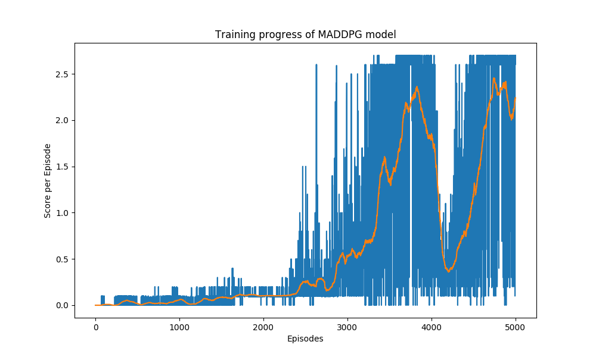

# Report

### Learning Algorithm
For this project, I used an off-policy method called `Multi Agent Deep Deterministic Policy Gradient (MADDPG)` algorithm. The implementation is based on the code in ddpg-bipedal code created by Udacity, but modified slightly to handle multiple simultaneous agents in the same environment.

#### Background for Deep Deterministic Policy Gradient (DDPG)
MADDPG find its origins in an off-policy method called **Deep Deterministic Policy Gradient (DDPG)** and described in the paper [Continuous control with deep reinforcement learning](https://arxiv.org/abs/1509.02971).
> We adapt the ideas underlying the success of Deep Q-Learning to the continuous action domain. We present an actor-critic, model-free algorithm based on the deterministic policy gradient that can operate over continuous action spaces. Using the same learning algorithm, network architecture and hyper-parameters, our algorithm robustly solves more than 20 simulated physics tasks, including classic problems such as cartpole swing-up, dexterous manipulation, legged locomotion and car driving. Our algorithm is able to find policies whose performance is competitive with those found by a planning algorithm with full access to the dynamics of the domain and its derivatives. We further demonstrate that for many of the tasks the algorithm can learn policies end-to-end: directly from raw pixel inputs.

#### Multi Agent Deep Deterministic Policy Gradient (MADDPG)
For this project I have used a variant of DDPG called **Multi Agent Deep Deterministic Policy Gradient (MADDPG)** which is described in the paper [Multi-Agent Actor-Critic for Mixed Cooperative-Competitive Environments](https://arxiv.org/abs/1706.02275).
> We explore deep reinforcement learning methods for multi-agent domains. We begin by analyzing the difficulty of traditional algorithms in the multi-agent case: Q-learning is challenged by an inherent non-stationarity of the environment, while policy gradient suffers from a variance that increases as the number of agents grows. We then present an adaptation of actor-critic methods that considers action policies of other agents and is able to successfully learn policies that require complex multi-agent coordination. Additionally, we introduce a training regimen utilizing an ensemble of policies for each agent that leads to more robust multi-agent policies. We show the strength of our approach compared to existing methods in cooperative as well as competitive scenarios, where agent populations are able to discover various physical and informational coordination strategies.

#### Network architecture

Both the actor and the critic models are a simple fully-connected DNN. After some experimenting, I found out that I have to add `nn.BatchNorm1d` layers to stabilize the learning. Without these additions, I could not solve the environment.

- file: `model.py`
- class: `TennisActorModel`

`TennisActorModel` is a simple fully-connected Deep Neural Network. The network has two hidden `nn.Linear` layers.

```
# ACTOR NETWORK
Fully Connected Layer(input_size=24, output_size=400)
ReLU
Batch Norm Layer

Fully Connected Layer(input_size=400, output_size=300)
ReLU

Fully Connected Layer(input_size=300, output_size=2)
Tanh
```

- file: `model.py`
- class: `TennisCriticModel`

`TennisCriticModel` is a simple fully-connected Deep Neural Network. The network has two hidden `nn.Linear` layers.

Critic input size is: `(24 states + 2 actions) * 2 agents = 52` 
```
# CRITIC NETWORK
Fully Connected Layer(input_size=52, output_size=400)
ReLU
Batch Norm Layer

Fully Connected Layer(input_size=400, output_size=300)
ReLU

Fully Connected Layer(input_size=300, output_size=1)
```

#### Hyperparameters
The **MADDPG** algorithm uses the following parameters values (defined in `agent.py`)

- **BUFFER_SIZE** = int(1e6)  # replay buffer size
- **BATCH_SIZE** = 512        # minibatch size 
- **GAMMA** = 0.99            # discount factor 
- **TAU** = 0.001             # for soft update of target parameters
- **LR_ACTOR** = 1e-4         # actor learning rate
- **LR_CRITIC** = 1e-4        # critic learning rate 
- **LEARN_AFTER_EVERY** = 6   # Execute the learning after # of episodes
- **LEARN_ITER** = 3          # Execute the learning # of times

### Logs

#### Plot of rewards


#### Output log
```
Found path: /home/pestipeti/Work/Udacity/Nanodegrees/Reinforcement Learning/UdacityDRLTennis/./Tennis_Linux/Tennis.x86_64
Mono path[0] = '/home/pestipeti/Work/Udacity/Nanodegrees/Reinforcement Learning/UdacityDRLTennis/./Tennis_Linux/Tennis_Data/Managed'
Mono config path = '/home/pestipeti/Work/Udacity/Nanodegrees/Reinforcement Learning/UdacityDRLTennis/./Tennis_Linux/Tennis_Data/MonoBleedingEdge/etc'
Preloaded 'ScreenSelector.so'
Preloaded 'libgrpc_csharp_ext.x64.so'
Unable to preload the following plugins:
        ScreenSelector.so
        libgrpc_csharp_ext.x86.so
Logging to /home/pestipeti/.config/unity3d/Unity Technologies/Unity Environment/Player.log
INFO:unityagents:
'Academy' started successfully!
Unity Academy name: Academy
        Number of Brains: 1
        Number of External Brains : 1
        Lesson number : 0
        Reset Parameters :
                
Unity brain name: TennisBrain
        Number of Visual Observations (per agent): 0
        Vector Observation space type: continuous
        Vector Observation space size (per agent): 8
        Number of stacked Vector Observation: 3
        Vector Action space type: continuous
        Vector Action space size (per agent): 2
        Vector Action descriptions: , 
Episode 100     Average Score: 0.0060   Episode score (max over agents): 0.0000
Episode 200     Average Score: 0.0030   Episode score (max over agents): 0.0000
Episode 300     Average Score: 0.0233   Episode score (max over agents): 0.1000
Episode 400     Average Score: 0.0451   Episode score (max over agents): 0.0000
Episode 500     Average Score: 0.0184   Episode score (max over agents): 0.0000
Episode 600     Average Score: 0.0206   Episode score (max over agents): 0.1000
Episode 700     Average Score: 0.0173   Episode score (max over agents): 0.0000
Episode 800     Average Score: 0.0228   Episode score (max over agents): 0.1000
Episode 900     Average Score: 0.0313   Episode score (max over agents): 0.0000
Episode 1000    Average Score: 0.0601   Episode score (max over agents): 0.1000
Episode 1100    Average Score: 0.0179   Episode score (max over agents): 0.0000
Episode 1200    Average Score: 0.0174   Episode score (max over agents): 0.1000
Episode 1300    Average Score: 0.0714   Episode score (max over agents): 0.0900
Episode 1400    Average Score: 0.0561   Episode score (max over agents): 0.0900
Episode 1500    Average Score: 0.0864   Episode score (max over agents): 0.1000
Episode 1600    Average Score: 0.0763   Episode score (max over agents): 0.1000
Episode 1700    Average Score: 0.1076   Episode score (max over agents): 0.1000
Episode 1800    Average Score: 0.1073   Episode score (max over agents): 0.1000
Episode 1900    Average Score: 0.1130   Episode score (max over agents): 0.1000
Episode 2000    Average Score: 0.1023   Episode score (max over agents): 0.1000
Episode 2100    Average Score: 0.1056   Episode score (max over agents): 0.1000
Episode 2200    Average Score: 0.1018   Episode score (max over agents): 0.1000
Episode 2300    Average Score: 0.1070   Episode score (max over agents): 0.1000
Episode 2400    Average Score: 0.1373   Episode score (max over agents): 0.3000
Episode 2500    Average Score: 0.2486   Episode score (max over agents): 0.1000
Episode 2600    Average Score: 0.2273   Episode score (max over agents): 0.3000
Episode 2700    Average Score: 0.2758   Episode score (max over agents): 0.1000
Episode 2800    Average Score: 0.1917   Episode score (max over agents): 0.1000
Episode 2900    Average Score: 0.4739   Episode score (max over agents): 0.6000
Episode 2906    Average Score: 0.5018   Episode score (max over agents): 0.5000

======================================================================================
Environment solved in 2906 episodes. Average score over the last 100 episodes: 0.5018
======================================================================================

Episode 3000    Average Score: 0.5332   Episode score (max over agents): 0.6000
Episode 3100    Average Score: 0.5293   Episode score (max over agents): 0.1000
Episode 3200    Average Score: 0.6401   Episode score (max over agents): 0.6000
Episode 3300    Average Score: 0.7114   Episode score (max over agents): 2.0000
Episode 3400    Average Score: 1.4202   Episode score (max over agents): 1.4000
Episode 3500    Average Score: 1.3414   Episode score (max over agents): 2.2000
Episode 3600    Average Score: 1.5986   Episode score (max over agents): 2.6000
Episode 3700    Average Score: 2.1743   Episode score (max over agents): 2.7000
Episode 3800    Average Score: 2.2723   Episode score (max over agents): 0.2000
Episode 3900    Average Score: 2.0364   Episode score (max over agents): 0.3000
Episode 4000    Average Score: 1.8296   Episode score (max over agents): 2.7000
Episode 4100    Average Score: 0.9654   Episode score (max over agents): 0.2000
Episode 4200    Average Score: 0.3613   Episode score (max over agents): 0.1000
Episode 4300    Average Score: 0.5504   Episode score (max over agents): 2.4000
Episode 4400    Average Score: 0.7802   Episode score (max over agents): 0.5000
Episode 4500    Average Score: 1.1975   Episode score (max over agents): 2.7000
Episode 4600    Average Score: 1.6624   Episode score (max over agents): 2.7000
Episode 4700    Average Score: 2.2160   Episode score (max over agents): 2.7000
Episode 4800    Average Score: 2.2957   Episode score (max over agents): 2.6000
Episode 4900    Average Score: 2.2718   Episode score (max over agents): 2.7000
Episode 5000    Average Score: 2.2417   Episode score (max over agents): 2.7000
```

### Ideas for Future Work
- Improve the replay buffer. Currently being sampled with equal probability. There could be better results by making use of priorotized experience with the learning algorithm.
- Monitoring actor/critic losses. I suspect (I did not checke) there is a bit of overfitting. Learning rate decay could be a solution.
- Other learning algorithms could be used. Twin Delayed DDPG (TD3) algorithm might be a good option.
